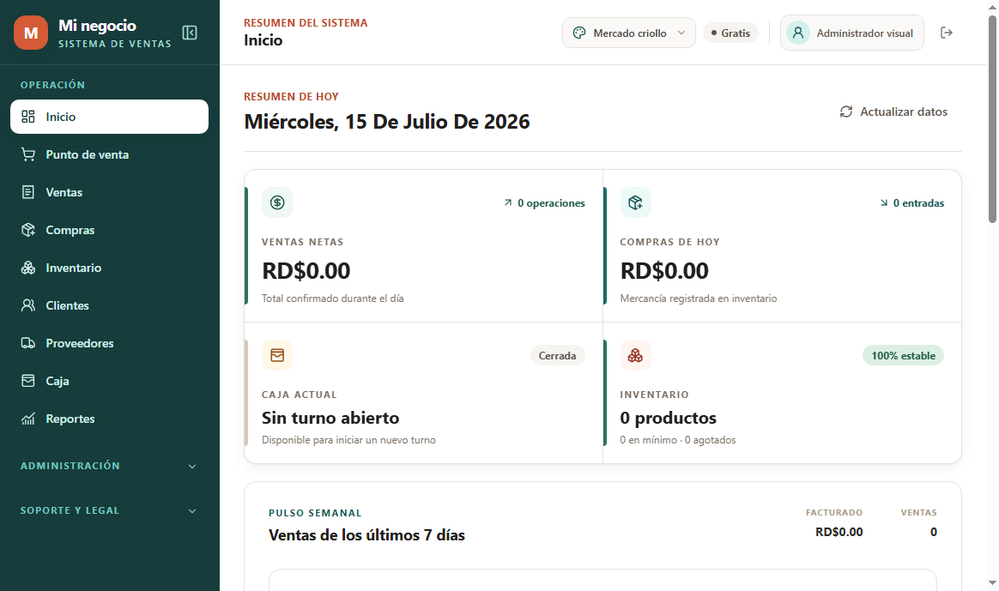
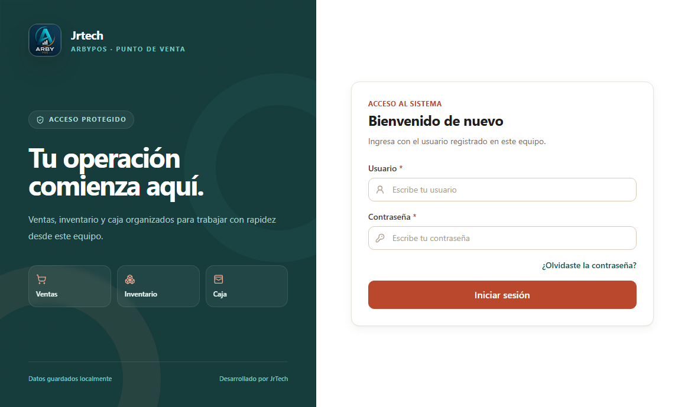

# ArbyPos Releases

Canal oficial de instaladores y actualizaciones de ArbyPos para Windows.

## ArbyPos para Windows

ArbyPos es un sistema de punto de venta para comercios que reúne ventas, caja,
inventario, compras, clientes, proveedores, reportes, impresión y control de usuarios
en una aplicación de escritorio rápida y preparada para trabajar aun cuando Internet
no está disponible.

[Descargar la versión más reciente](https://github.com/elx19/ArbyPos-Releases/releases/latest)

## Vistas del sistema ArbyPos

### Panel principal

### Inicio de sesión

## Funciones principales

### Ventas y punto de venta

- Búsqueda de productos por nombre, código interno o código de barras.
- Carrito con imagen, cantidad, precio y descuento por producto.
- Formas de pago en efectivo, tarjeta, otros medios y pagos mixtos según el plan.
- Cálculo automático del monto entregado y el cambio.
- Selección de impresión al confirmar la venta.
- Historial de ventas, consulta de comprobantes y anulaciones autorizadas.
- Números de comprobante cortos y únicos por instalación.

### Inventario y compras

- Productos, categorías, costos, precios, existencia mínima e imágenes.
- Entradas por compras, ajustes manuales y salidas automáticas por ventas.
- Kardex y alertas de productos agotados o con existencia baja.
- Proveedores asociados a productos.
- Etiquetas con códigos de barras en formatos térmicos y A4.

### Caja y reportes

- Apertura y cierre de caja con monto inicial, esperado, contado y diferencia.
- Ingresos, gastos, ventas y anulaciones reflejados en el balance.
- Resumen diario y panel con ventas, compras, caja e inventario.
- Reportes por fechas, productos, cajeros y formas de pago.
- Exportación de información y documentos imprimibles según permisos y plan.

### Impresión

- Tickets de 58 mm y 80 mm.
- Facturas, cierres y etiquetas en A4.
- Impresión mediante controladores de Windows.
- Transporte ESC/POS RAW para impresoras térmicas compatibles.
- Logo, datos fiscales y formato del negocio configurables.

### Usuarios, seguridad y licencias

- Inicio de sesión, recuperación de contraseña y control de intentos fallidos.
- Roles personalizables con permisos separados por función.
- Registro de auditoría de operaciones importantes.
- Ediciones Gratis y Premium con licencias firmadas.
- Activación, renovación, revocación y validación periódica de licencias.
- Datos operativos guardados localmente en SQLite.

### Red local y acceso móvil

- Detección automática de otras cajas ArbyPos conectadas a la misma red.
- Autorización mediante un código privado compartido y protegido en Windows.
- Sincronización cifrada y firmada entre los equipos autorizados.
- POS móvil mediante QR de un solo uso.
- Consulta de inventario, carrito, formas de pago y ventas reales desde el teléfono.
- Sesiones móviles temporales vinculadas al usuario que genera el acceso.

### Actualizaciones

- Consulta de nuevas versiones desde GitHub Releases.
- Descarga e instalación de actualizaciones desde la ayuda del sistema.
- Verificación de integridad de los archivos publicados.

## Ediciones

| Edición | Uso recomendado | Funciones destacadas |
| --- | --- | --- |
| Gratis | Un negocio que inicia en un equipo | Ventas, inventario, caja, compras, terceros, impresión y operación local |
| Premium mensual | Negocios que necesitan flexibilidad | Usuarios ampliados, funciones avanzadas, red local, sincronización y métodos adicionales |
| Premium permanente | Negocios que prefieren un único pago | Acceso permanente a las funciones Premium incluidas en la licencia adquirida |

Los precios y condiciones vigentes se muestran dentro de ArbyPos o se confirman con
JrTech antes de activar una licencia.

## Versiones

| Versión | Estado | Contenido principal |
| --- | --- | --- |
| `v0.1.0` | Disponible | Primera versión pública para Windows con POS, inventario, compras, caja, reportes, roles, licencias, impresión y actualizaciones |
| `v0.2.0` | Disponible | Detección automática de PCs, sincronización segura por código privado, POS móvil real, SQLite v15 y nuevo fondo de acceso |
| `v0.2.1` | Disponible | Navegación que vuelve al inicio de cada pantalla y estado neutral cuando todavía no hay productos |
| `v0.2.2` | Disponible | Documentos legales dentro de Ayuda, instalador Windows actualizado y mejoras acumuladas de operación, licencias, impresión y sincronización |
| `v0.3.10` | Disponible | Respaldos Google Drive reales, restauración tolerante a desconexiones, validación de stock concurrente, actualización segura y mejoras de sincronización 
| `v1.3.2` | Disponible | Localización completa por país, idioma automático, nombres de monedas traducidos y cambio instantáneo de formato regional |
| `v1.3.1` | Disponible | Interfaz completa en Español, Português e English; traducción de formularios, acciones y mensajes; actualización regional Premium |
| `v1.3.0` | Disponible | Códigos de barras manuales, categorías en Ventas, comprobantes cortos, campana de actualizaciones y configuración regional |

Consulta [VERSIONES.md](VERSIONES.md) para conocer el contenido detallado y las
correcciones de cada publicación.

## Requisitos

- Windows 10 u 11 de 64 bits.
- Procesador de 2 núcleos o superior y 4 GB de RAM (8 GB recomendados para varias cajas).
- Al menos 500 MB libres para instalar ArbyPos, además del espacio requerido por datos y respaldos.
- Permisos para instalar aplicaciones de escritorio.
- Impresora configurada en Windows si se utilizará impresión.
- Internet solo para activación/validación de licencias, recuperación de contraseña, Google Drive y actualizaciones.
- Para red local y móvil: todos los dispositivos deben estar conectados a la misma
  red privada del negocio.

El POS puede seguir registrando operaciones sin Internet cuando la licencia local esté
vigente. Para red local o acceso móvil, permite ArbyPos en el Firewall de Windows solo
para redes privadas.

## Instalación

1. Abre la sección [Releases](https://github.com/elx19/ArbyPos-Releases/releases).
2. Selecciona la versión más reciente.
3. Descarga `ArbyPos-Setup-x.x.x.exe`.
4. Ejecuta el instalador y elige la carpeta de instalación.
5. Abre ArbyPos y crea el administrador inicial.
6. Configura el negocio, la caja y la impresora antes de comenzar a vender.

## Conectar varias PCs

1. Conecta todas las computadoras a la misma red privada.
2. Abre **Administración > Sincronización > Red local** en la primera PC.
3. Activa **Detectar equipos automáticamente**.
4. Genera un código privado seguro y guarda la configuración.
5. Introduce exactamente el mismo código en cada PC adicional.
6. Activa **Conectar y sincronizar automáticamente** en todos los equipos.
7. Comprueba que cada caja aparezca como **Confiable · Automático**.

Cuando Windows muestre el aviso del firewall, permite ArbyPos únicamente en **redes
privadas**. No habilites el servidor LAN en redes públicas de hoteles, aeropuertos o
centros comerciales.

## Usar ArbyPos desde el teléfono

1. Conecta el teléfono al mismo Wi-Fi privado de la PC principal.
2. Abre **Sincronización > Red local** y selecciona **Generar QR**.
3. Escanea el código con la cámara del teléfono.
4. Utiliza el POS móvil para buscar productos, preparar el carrito y registrar ventas.

El QR se utiliza una sola vez, vence a los cinco minutos si no se escanea y crea una
sesión temporal de hasta ocho horas. Para vender debe existir una caja abierta en la
PC principal.

## Idioma y tecnología

- Interfaz traducible a Español, Português e English, con país, idioma y moneda configurables desde el primer inicio; los formatos monetarios y de fecha se adaptan a la selección regional.
- Aplicación de escritorio: Electron, TypeScript y Vue 3.
- Base de datos local: SQLite.
- Comunicación LAN: HTTP local, UDP para descubrimiento y cifrado de extremo a extremo
  entre instalaciones autorizadas.
- Plataforma de actualizaciones: GitHub Releases.
- Copias de seguridad locales cifradas y sincronización opcional con Google Drive.

## Desarrollador y soporte

Desarrollado por **JrTech**.

- WhatsApp: [+1 809 404 2070](https://wa.me/18094042070)
- Producto: ArbyPos para Windows
- Soporte: instalación, configuración, licencias, impresión y red local

Al solicitar ayuda, indica la versión de ArbyPos, la edición de Windows y una descripción
clara del inconveniente. Nunca envíes contraseñas o códigos privados de la red.
